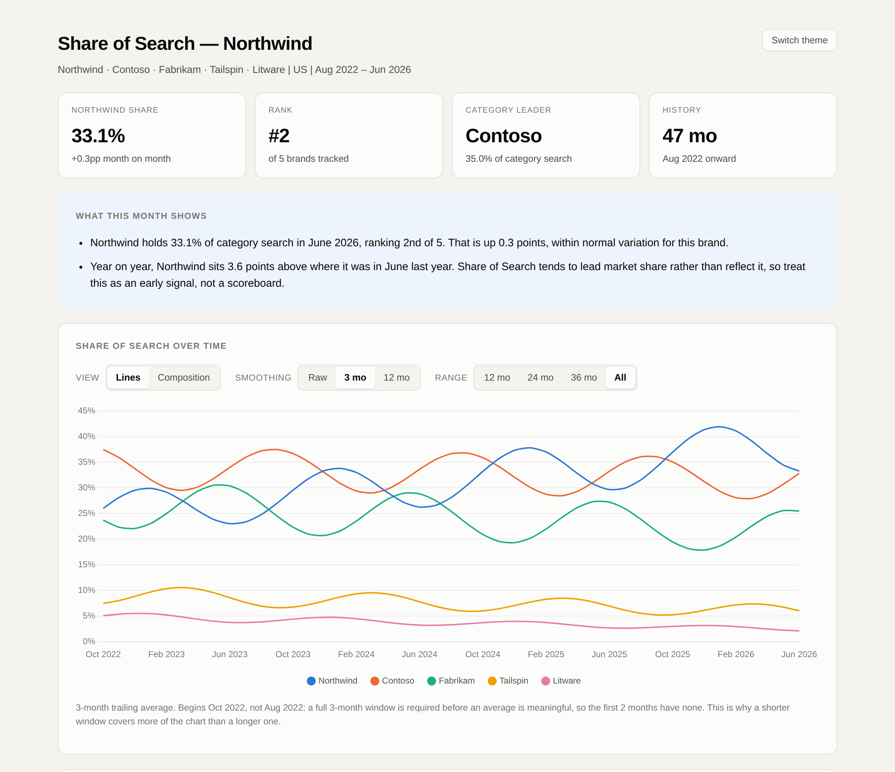

# Share of Search

Track whether your brand's demand is growing or shrinking against a competitor set you
define, from monthly search volume.

## The problem

**Last-click attribution only sees demand you captured, never demand you influenced.**

Someone searches your brand name, clicks a paid ad, converts. Paid search takes the credit.
But something made them type your name — a campaign, a mention, six months of brand work.
That scores zero in the model, so it's the first budget cut and the hardest to defend.

The tools that do measure it are enterprise SaaS: brand trackers, panel-based market share,
marketing mix modelling. Enterprise pricing, quarterly data, onboarding in weeks. Fine for
a global brand. Out of reach for most agency–client work, and heavy for a question as plain
as "is demand moving?"

So the quarterly review falls back on impressions, reach and engagement, which no CFO
accepts as evidence that anything changed.

## What Share of Search measures

Branded search is someone typing your name on purpose. That's a signal of demand, not a
record of a conversion.

Share of Search is your brand's slice of all branded search in a category you define:

```
        your brand's monthly search volume
  ─────────────────────────────────────────────────  ×  100
   total monthly volume across your set of brands
```

Les Binet showed that this correlates with market share and tends to **lead** it — by about
three months in fast-moving categories, up to twelve for considered purchases. See
[Share of Search as a Predictive Measure](https://www.youtube.com/watch?v=x1zMufAs3l0),
IPA EffWorks Global 2020.

It is not a prediction of market share, and it explains nothing on its own. It's an early
signal you can pull monthly. Read [How to read the output](#how-to-read-the-output) before
you quote a number — it lists the ways this can mislead you.

## What you'd use it for

- **Show brand work did something** when last-click says it didn't. Branded search going up
  is demand created, and it moves before revenue does.
- **Defend or grow a brand budget** with a number rather than an assertion.
- **Read a campaign early** — weeks after it ends, not two quarters later.
- **See what a competitor's move did.** Did they take your demand, or grow the category?
  Share and category total answer different questions.
- **Bring something to a QBR** that isn't impressions, and that the client can check.

## What this repo is

A command-line tool. It pulls monthly branded search volume for you and your competitors
from DataForSEO, works out each brand's share, and writes two things:

- `data/sos_monthly.csv` — one row per brand per month, for your own analysis
- a self-contained HTML dashboard — one file, opens by double-clicking, works offline,
  survives being emailed to a client

No server, no database, no login, no subscription. You bring a DataForSEO account; the rest
is a `git clone`.



*Illustrative brand set and synthetic volumes — the layout is exactly what a real run produces.*

---

## Install

```bash
git clone https://github.com/afllewellyn/share-of-search-tool.git
cd share-of-search-tool
python -m venv .venv && source .venv/bin/activate
pip install -e .
```

You need a [DataForSEO](https://dataforseo.com/) account. Their Keywords Data API is
pay-as-you-go, and your whole brand set goes out in a **single request**, however many
brands and months you ask for.

```bash
export DATAFORSEO_LOGIN='your-login'         # the email you registered with
export DATAFORSEO_PASSWORD='your-password'   # the API password from your dashboard
```

Or copy `.env.example` to `.env` and fill it in. `.env` is gitignored and loaded
automatically.

## Quickstart

The 30-second version needs no config file:

```bash
sos run --brand Anthropic --competitors "OpenAI,Perplexity,Mistral"
sos dashboard --open
```

That backfills the full history (about four years), writes `data/sos_monthly.csv`, and
opens the dashboard.

For anything you'll run more than once, use a config file so each brand can have several
keywords:

```bash
sos init          # interactive: brands, their keywords, market
sos validate      # checks config and credentials, calls nothing
sos run
sos dashboard --open
```

`sos init` walks three steps: who's in the category, **what each brand is searched as**,
and the market. The middle step decides whether the percentages are fair. It asks each
brand for its sub-brands, product lines and variants, so one brand isn't tracked on its
name alone while a competitor gets five keywords.

On a first pull, `sos run` asks how far back to reach — full history, two years, one year,
or a custom range. Take the full history unless you have a reason not to: it's the same
single request either way, and the 12-month average needs the depth. `--months N` skips the
question, `--no-prompt` skips it in a script.

Re-run `sos run` for fresh data. It pulls new months and re-pulls the trailing twelve,
because Google revises recent history and a wider window costs no extra request. Runs are
idempotent — the same command twice leaves the store byte-identical.

Change your competitor set and the next run reconciles the store to match. Brands you
removed are dropped rather than left behind inflating the category total.

## Everyday use

Day to day, one command instead of three:

```bash
sos refresh
```

It updates the tool, pulls fresh data, rebuilds the report and opens it. That last step is
easy to forget — the dashboard is a generated file, so `git pull` alone changes nothing you
can see.

`refresh` fails safe:

- It only pulls the checkout the running code came from, never whatever directory you're
  standing in.
- Uncommitted edits stop the pull rather than being pulled over. Fast-forward only.
- A failed pull is a reason to carry on to the data, not to stop.
- A failed *data* pull stops it without rebuilding. A report that looks fresh while showing
  last week's numbers is worse than no new report.

When a pull brings in new code, `refresh` restarts itself first. Otherwise it would
download an update and then run the old copy already loaded in memory.

The pull only does something if you installed with `pip install -e .` — a plain
`pip install .` makes a separate copy, so reinstall to update. `--no-pull` skips it. For
anything specific, like a date range, ad-hoc brands or a dry run, use `sos run`.

## Commands

```
sos init                 Write a config file interactively. Won't overwrite without --force.
sos validate             Check config and credentials. No API call.
sos run                  Pull volumes and update the store.
sos dashboard            Build the HTML report from stored data. No API call.
sos refresh              Update the tool, pull data, rebuild and open. The everyday one.
```

Useful `sos run` flags:

| Flag | What it does |
|---|---|
| `--brand` / `--competitors` | Ad-hoc mode — no config file needed |
| `--months N` | Pull the trailing N months |
| `--backfill` | Pull the full available history |
| `--from YYYY-MM` / `--to YYYY-MM` | Explicit range |
| `--refresh-last N` | Re-pull the trailing N months to absorb Google's revisions |
| `--market US` | Market shorthand (`US`, `UK`, `DE`, …) |
| `--data-dir PATH` | Where the CSV store lives, default `./data` |
| `--dry-run` | Show the request plan, call nothing |
| `--no-prompt` | Never ask anything interactively — for scripts and CI |

`sos <command> --help` has the rest.

## Configuration

`config/brands.yaml` — gitignored, so your competitor set never lands in version control.
Copy `config/brands.example.yaml` to start:

```yaml
market:
  name: US
  location_code: 2840        # DataForSEO location code
  language_code: en

smoothing_windows: [3, 12]   # months; the dashboard defaults to 3

own_brand:
  name: Acme
  url: https://www.acme.com
  keywords:
    - acme
    - acme app
  ambiguous: false

competitors:
  - name: Globex
    keywords: [globex]
  - name: Emma
    keywords: [emma mattress]   # disambiguated on purpose
    ambiguous: true             # generic word — flagged in the dashboard
```

**Give each brand the variants people actually search.** A brand on one keyword against a
competitor on five looks smaller than it is, and nothing in the output reveals why.
`sos validate` warns when one brand's coverage is more than three times another's. Extra
keywords don't add requests — the whole set goes out in one.

**Set `ambiguous: true` for brand names that are also ordinary words** — Emma, Apple,
Orange. Their volume includes searches unrelated to the brand. The flag doesn't correct for
it; it surfaces the caveat in the dashboard so nobody quotes the number without it.

## The data store

`data/sos_monthly.csv`, one row per brand per month per market:

`date` · `year` · `month` · `brand` · `is_own_brand` · `market` · `location_code` ·
`language_code` · `keywords` · `raw_volume` · `category_total_volume` · `sos_pct` ·
`sos_pct_3mo` · `sos_pct_12mo` · `volume_3mo` · `data_source` · `pulled_at`

`raw_volume` is the only source of truth. Every other number is recomputed across the whole
series on each write, so Google's revisions to old months just flow through. Writes go to a
temp file and are atomically renamed, so an interrupted run can't corrupt the store.

`data/` and `output/` are gitignored by default, so nobody accidentally commits a client's
competitor set. If you *want* results in version control, delete those two lines from
`.gitignore`.

## How to read the output

Share of Search is a **leading indicator correlated with market share**. Not a prediction
of it, and not an explanation of anything. A few things will mislead you if you let them:

- **The denominator is your competitor set, never total search.** Add or remove a brand and
  every number changes. If the set is missing a competitor, every figure is overstated. The
  tool warns when your own brand exceeds ~65%, which usually means someone's missing.
- **A brand's share can rise because a competitor collapsed.** The most common misreading.
  When the category total moves enough that share shifts are mostly a denominator effect,
  the commentary says so first.
- **Single months are noisy.** Seasonality alone moves these lines — that's what the
  smoothing toggle is for. The tool also measures each brand's own volatility and tells you
  when a move sits inside it.
- **A longer smoothing window covers less of the chart. That's correct.** Rolling averages
  are trailing and full: a 12-month average needs twelve months before it has a value, so
  it starts nine months after the 3-month one. Averaging four months and calling it a
  twelve-month average would be the real error. The chart trims the empty run-up and says
  which month each view starts.
- **Google's volumes are rounded and bucketed.** Absolute numbers are approximate. Share is
  a ratio, so consistent estimation bias largely cancels. Read the trend, not the decimal.
- **Lead times vary by category** — roughly three months in fast-cycle categories, up to
  twelve for considered purchases.
- **The current month is never available** from Google Ads, and in practice the data lags
  by about two months. The tool caps its requests accordingly.

The dashboard's "About this metric" section carries all of this, so a report that leaves
your hands still explains itself.

## Commentary

Every run prints a sentence or two on what moved and whether it means anything. These come
from rule-based templates over a facts payload computed in pandas — **no LLM, no API key,
no network**.

No number is ever generated by a language model. `facts.py` computes deltas, ranks, noise
thresholds and category effects; `commentary.py` only phrases them. Swapping
`commentary.generate()` for a model call changes one function and nothing else.

## Development

```bash
pip install -e ".[dev]"
pytest
```

The tests run entirely against `tests/fixtures/sample_response.json` — no live API calls,
no credentials needed. They cover the parts where a bug does real damage: keyword grouping,
brand aggregation, the share calculation, rolling windows, store idempotency, and the
self-containment of the generated HTML.

**The dashboard bundles Chart.js instead of loading it from a CDN**, and inlines its data
instead of fetching a sibling `data.json` — a page opened over `file://` can't fetch
anything. That's what makes it work on someone else's machine, offline. Chart.js 4.4.1 is
vendored under `src/sos/dashboard/vendor/`, MIT licensed.

### Adding a different data source

`src/sos/datasource/base.py` defines the interface:

```python
fetch_monthly_volume(keywords, location_code, language_code, date_from, date_to)
    -> list of {keyword, year, month, search_volume}
```

Nothing DataForSEO-specific leaks past that boundary, so a Google Ads API backend is a
drop-in replacement.

### On grouped keywords

Google Ads returns a *combined* volume for keywords it considers close variants. Summing
them doubles that brand's volume and inflates its share. The numbers still look plausible.

The tool detects this. Within one brand, keywords returning identical volumes in every
month where both have data are counted once, and a warning names what was dropped. It needs
at least two such months, and not all zeros.

Verified against live data: `openai` and `open ai` came back identical in 47 of 47 months
and were collapsed. `anthropic` and `anthropic ai` matched in 0 of 47 and were kept
separate.

Merging keywords needs at least six months of data to be safe. That's why the default
refresh window is twelve months.

### On history depth

DataForSEO's docs disagree about whether Google Ads serves 24 or 48 months. Measured
against the live API on 2026-08-01 (US, en): a request for 48 returned **47**, roughly four
years. The most recent month was missing because the data lags by two months, not one. The
tool requests 48, reports what arrived, and handles either.

## Not in this version

Scheduled runs with commit-back · hosted dashboards · ESOS (needs market-share data) · paid
search and SERP share of voice · multi-market and multi-language in one run · a Google Ads
API backend · Google Trends cross-checks for ambiguous brands · PyPI publication.

The seams are there — the `datasource` interface, the `market` columns already in the
schema — but none of it is built.

## Licence

MIT. See [LICENSE](LICENSE).

Share of Search as a metric is Les Binet's work, presented at IPA EffWorks Global 2020. The
IPA think-tank findings behind it are correlations, not causal relationships.
